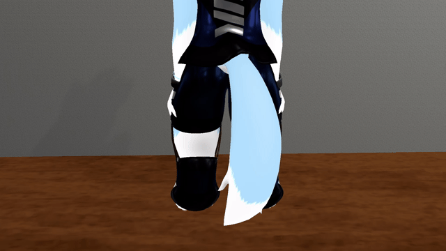

# 何ができるの？
・ルル君が尻尾を振ることができるようになります  
・尻尾振り速度の調整ができます  
・MMDをONにすると尻尾振りをやめます  
&emsp;  
  
# 注意事項など
・対応アバターは、らすちんワークス様の[ルル (Lulu)](https://aoikarasu.booth.pm/items/4271776)、[ルル少年期（Lulu.juvenileVer)](https://aoikarasu.booth.pm/items/6101679)、  
　[ルル（Ifの姿） (Lulu.AnotherVer)](https://aoikarasu.booth.pm/items/6544416)です  
・ExpressionParameterを9使用します  
・MMDボタンを削除している場合は尻尾振りが機能しない可能性があります  
  
# 導入手順
1.&nbsp;[Modular Avatar](https://modular-avatar.nadena.dev/ja)をプロジェクトに追加します  
  
2.&nbsp;[Releases](https://github.com/Luke-514/Lulu_Tail_Move/releases/latest)からLulu_Tail_Move.unitypackageをダウンロードして、プロジェクトにインポートします  
  
3.&nbsp;Assets>Lulu_Tail_Moveの中にあるLulu_Tail_Move.prefabをアバター直下に追加します  
&emsp;  
  
# 参考
しぐにゃもブログ  
【VRChat】尻尾にIdleアニメを追加する方法（Fx-Float）  
https://signyamo.blog/vrchat_not_humanoid_anim/  
  
# 免責事項
本アセットの使用によって発生した、いかなる損害に対しても作者は一切の責任を負いません  
  
# 利用規約
本アセットの改変・二次配布を許可します  
(二次配布を行う際はクレジットに作者の名前を記載していただけると嬉しいです)  
  
# 作者
Luke514  
  
# Special Thanks
優希@白狼わんこ  
Tちゃん  
わからん  
ソアラ  
くりたま  

# 関連アセット
・[まばたきシステム](https://github.com/Luke-514/Lulu_Mabataki)  
・[なでなでシステム](https://github.com/Luke-514/Lulu_Nade)  
  
# 寄付

