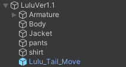

# 何ができるの？
・ルル君が尻尾を振ることができるようになります  
・Radial Puppetによる速度調整ができます  
・MMDをONにすると尻尾振りをやめます  
  
# 注意事項など
・ExpressionParameterを8使用します  
・床貫通対策コライダーを導入すると座った際の尻尾の挙動がいい感じになります  
&emsp;https://booth.pm/ja/items/4724758  
  
# 導入手順
1. Moduler Avaterをプロジェクトに追加します  
https://modular-avatar.nadena.dev/ja  
  
2. Tail_Move.unitypackageをプロジェクトにインポートします  
  
3. Assets>Lulu_Tail_Moveの中にあるTail_Move.prefabをアバター直下に追加します  
  
  
# 参考
しぐにゃもブログ  
【VRChat】尻尾にIdleアニメを追加する方法（Fx-Float）  
https://signyamo.blog/vrchat_not_humanoid_anim/  
  
# 免責事項
本アセットの使用によって発生した、いかなる損害に対しても作者は一切の責任を負いません  
  
# 作者
Luke514  
  
# Special Thanks
優希@白狼わんこ  
Tちゃん  
わからん  
ソアラ  
